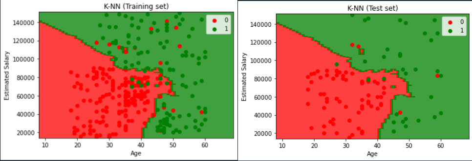
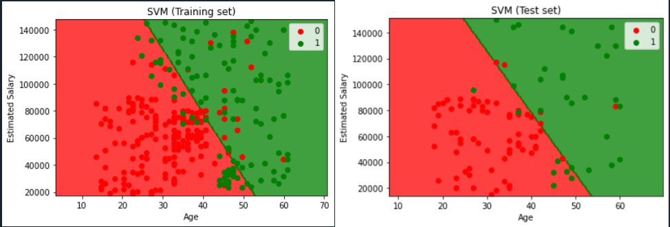
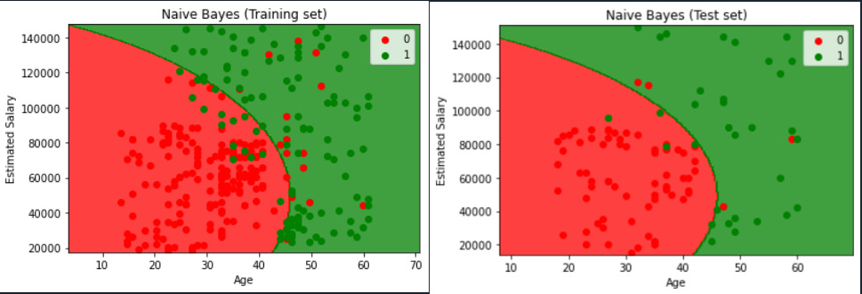

# Classifaction-algorithms-ML  
This is a simple implementation of all the regression models used in Machine Learning using python.

___   

# Installations 

```python
pip install numpy   
pip intall matplotlib   
pip install pandas   

```

>Note* The dataset used is named "Social_Network_Ads.csv"


## TABLE OF CONTENTS   
1. [Logistic Regression](##Logistic-Regression)
2. [KNN classification](##KNN-classification)   
3. [SVM classification](##SVM)
4. [Kernal SVM classification](##KernalSVM)
5. [Naive Bayes classification](##Naive)

___

## Logistic Regression 

Logistic regression is a supervised learning classification algorithm used to predict the probability of a target variable. The nature of target or dependent variable is dichotomous, which means there would be only two possible classes.
In simple words, the dependent variable is binary in nature having data coded as either 1 (stands for success/yes) or 0 (stands for failure/no).   

### **Steps involved**   
1. Importing the libraries.
2. Importing the dataset.
3. Splitting the dataset to training and testing sets.
4. Feature Scaling.
5. Training the logistic regression model on training set.
6. Predicting a new result.
7. Predicting the test result.
8. Making the confusion matrix.
9. Visualizing the training set results.
10. Visualizing the testing set results.   
 
 >*Note: The dataset used in logistic regression classification model is 'Social_Network_Ads.csv'.   

 ### **Observation**   

 The confusion matrix observed,   
 |   63  |   5	|
|---	|---	|
|   8	|  24	|

Where,   
True positive = 63   
False negative = 5   
True negative = 24   
False positve = 8   

The overall accuracy of this model was observed to be 87 %.

### **Visualization of Output**  

  
 ___   

## KNN Classification   

K-Nearest Neighbors (KNN) is one of the simplest algorithms used in Machine Learning for regression and classification problem. KNN algorithms use data and classify new data points based on similarity measures (e.g. distance function).
Classification is done by a majority vote to its neighbors. The data is assigned to the class which has the nearest neighbors. As you increase the number of nearest neighbors, the value of k, accuracy might increase.   

### Algorithm   
Step 1: Choose the number of k-neighbors. Default/common = 5.   
Step 2: Take the k-nearest neighbor of the data point, according to Euclidean distance.   
```
Euclidean distance = sqrt[(x_2 - x_1)^2 + (y_2 - y_1)^2]
```   
Step 3: Among the k neighbors, count the number of data points in each category.    
Step 4: Assign the new data point to the category where you counted the most neighbors.   

### **Steps Involved**   
1. Importing the libraries.
2. Importing the dataset.
3. Splitting the dataset to training and testing sets.
4. Feature Scaling.
5. Training the Knn classidication model on training set.
6. Predicting a new result.
7. Predicting the test result.
8. Making the confusion matrix.
9. Visualizing the training set results.
10. Visualizing the testing set results.    

 ### **Observation**   

 The confusion matrix observed,   
 |   64  |   4	|
|---	|---	|
|   3	|  29	|

Where,   
True positive = 64  
False negative = 4   
True negative = 29   
False positve = 3   

The overall accuracy of this model was observed to be 93 %.   

### **Visualization of Output**  

 

___ 

## SVM   

“Support Vector Machine” (SVM) is a supervised machine learning algorithm that can be used for both classification or regression challenges. However,  it is mostly used in classification problems. In the SVM algorithm, we plot each data item as a point in n-dimensional space (where n is a number of features you have) with the value of each feature being the value of a particular coordinate. Then, we perform classification by finding the hyper-plane that differentiates the two classes.   


### **Steps Involved**   
1. Importing the libraries.
2. Importing the dataset.
3. Splitting the dataset to training and testing sets.
4. Feature Scaling.
5. Training the SVM classidication model on training set.
6. Predicting a new result.
7. Predicting the test result.
8. Making the confusion matrix.
9. Visualizing the training set results.
10. Visualizing the testing set results.   

 ### **Observation**   

 The confusion matrix observed,   
 |   63  |   5	|
|---	|---	|
|   7	|  25	|

Where,   
True positive = 63  
False negative = 5   
True negative = 25   
False positve = 7  

The overall accuracy of this model was observed to be 88 %.

### **Visualization of Output**

 

___   

## Kernal SVM

Kernal SVM is similar to SVM classifaction except for the fact that non-linear models can be created by using kernals.   

*Pros:*   
* It works really well with a clear margin of separatio.    
* It is effective in high dimensional spaces.
* It is effective in cases where the number of dimensions is greater than the number of samples.   
* It uses a subset of training points in the decision function (called support vectors), so it is also memory efficient.   

*Cons:*
* It doesn’t perform well when we have large data set because the required training time is higher.
* It also doesn’t perform very well, when the data set has more noise i.e. target classes are overlapping.
* SVM doesn’t directly provide probability estimates, these are calculated using an expensive five-fold cross-validation. 
* It is included in the related SVC method of Python scikit-learn library.   

### **Steps Involved**   
1. Importing the libraries.
2. Importing the dataset.
3. Splitting the dataset to training and testing sets.
4. Feature Scaling.
5. Training the Kernal SVM classidication model on training set.
6. Predicting a new result.
7. Predicting the test result.
8. Making the confusion matrix.
9. Visualizing the training set results.
10. Visualizing the testing set results.   

 ### **Observation**   

 The confusion matrix observed,   
 |   64  |   4	|
|---	|---	|
|   3	|  29	|

Where,   
True positive = 64  
False negative = 4   
True negative = 29   
False positve = 3 

The overall accuracy of this model was observed to be 93 %.   

## Visualisation of output   


___   

## Naive Bayes Classifcation    
Naïve Bayes algorithm is a supervised learning algorithm, which is based on Bayes theorem and used for solving classification problems.
It is mainly used in text classification that includes a high-dimensional training dataset.
Naïve Bayes Classifier is one of the simple and most effective Classification algorithms which helps in building the fast machine learning models that can make quick predictions.
It is a probabilistic classifier, which means it predicts on the basis of the probability of an object.
Some popular examples of Naïve Bayes Algorithm are spam filtration, Sentimental analysis, and classifying articles. It is called Naïve because it assumes that the occurrence of a certain feature is independent of the occurrence of other features. Such as if the fruit is identified on the bases of color, shape, and taste, then red, spherical, and sweet fruit is recognized as an apple. Hence each feature individually contributes to identify that it is an apple without depending on each other.   

```
P(A|B) = [P(B|A) * P(A)] / P(B)

```   

### **Steps Involved**   
1. Importing the libraries.
2. Importing the dataset.
3. Splitting the dataset to training and testing sets.
4. Feature Scaling.
5. Training the Naive Bayes classidication model on training set.
6. Predicting a new result.
7. Predicting the test result.
8. Making the confusion matrix.
9. Visualizing the training set results.
10. Visualizing the testing set results.   

 ### **Observation**   

 The confusion matrix observed,   
 |   64  |   4	|
|---	|---	|
|   5	|  27	|

Where,   
True positive = 64  
False negative = 4   
True negative = 27 
False positve = 5

The overall accuracy of this model was observed to be 91 %.   

## Visualisation of output   

   
___