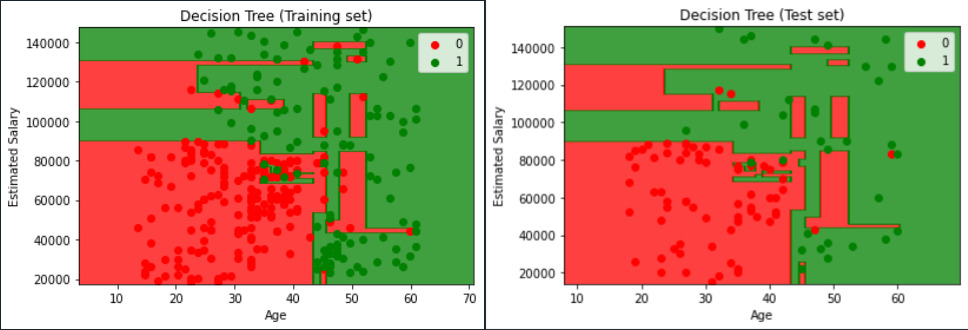
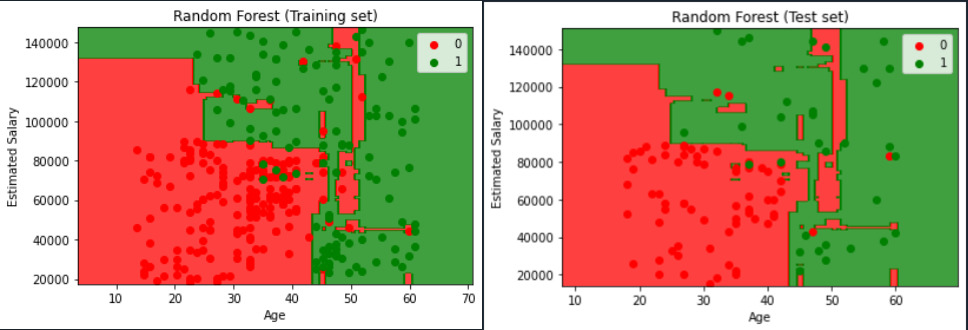

# Classifaction-algorithms-ML  
Implementation, Model Selection and Evaluation of Model Performance of most commonly used Machine Learning Classification algorithms in machine Learning

___   

# Installations 

```python
pip install numpy   
pip intall matplotlib   
pip install pandas   

```   
___

# Table Contents

|  S.N 	| TITLE 	|  Description  	| Dataset used  	|
|---	|---	|---	|---	|
|   1. 	|   Implementation	|  This a implementation of clasification models in ML 	| Social_Network_Ads.csv   	|
|  2.  	| Model Selection 	| Implementation of all algorithms for selection of best model  	|  Data.csv 	|
| 3.    | Evaluation | Evaluation of performance of algorithms | - |   

___


## TABLE OF CONTENTS   
1. Logistic Regression
2. KNN classification
3. SVM classification
4. Kernal SVM classification
5. Naive Bayes classification
6. Decision Tree classification
7. Random Forest classification

___  

# **Implementation**

>Note* The dataset used is named "Social_Network_Ads.csv"   

>
### **Steps involved**   
1. Importing the libraries.
2. Importing the dataset.
3. Splitting the dataset to training and testing sets.
4. Feature Scaling.
5. Training the model on training set.
6. Predicting a new result.
7. Predicting the test result.
8. Making the confusion matrix.
9. Visualizing the training set results.
10. Visualizing the testing set results.

## **Logistic Regression**

Logistic regression is a supervised learning classification algorithm used to predict the probability of a target variable. The nature of target or dependent variable is dichotomous, which means there would be only two possible classes.
In simple words, the dependent variable is binary in nature having data coded as either 1 (stands for success/yes) or 0 (stands for failure/no).   

 ### **Observation**   

 The confusion matrix observed,   
 |   63  |   5	|
|---	|---	|
|   8	|  24	|

Where,   
True positive = 63   
False negative = 5   
True negative = 24   
False positve = 8   

The overall accuracy of this model was observed to be 87 %.

### **Visualization of Output**  

  
 ___   

## **KNN Classification**   

K-Nearest Neighbors (KNN) is one of the simplest algorithms used in Machine Learning for regression and classification problem. KNN algorithms use data and classify new data points based on similarity measures (e.g. distance function).
Classification is done by a majority vote to its neighbors. The data is assigned to the class which has the nearest neighbors. As you increase the number of nearest neighbors, the value of k, accuracy might increase.   

### Algorithm   
Step 1: Choose the number of k-neighbors. Default/common = 5.   
Step 2: Take the k-nearest neighbor of the data point, according to Euclidean distance.   
```
Euclidean distance = sqrt[(x_2 - x_1)^2 + (y_2 - y_1)^2]
```   
Step 3: Among the k neighbors, count the number of data points in each category.    
Step 4: Assign the new data point to the category where you counted the most neighbors.      

 ### **Observation**   

 The confusion matrix observed,   
 |   64  |   4	|
|---	|---	|
|   3	|  29	|

Where,   
True positive = 64  
False negative = 4   
True negative = 29   
False positve = 3   

The overall accuracy of this model was observed to be 93 %.   

### **Visualization of Output**  

 

___ 

## **SVM**   

“Support Vector Machine” (SVM) is a supervised machine learning algorithm that can be used for both classification or regression challenges. However,  it is mostly used in classification problems. In the SVM algorithm, we plot each data item as a point in n-dimensional space (where n is a number of features you have) with the value of each feature being the value of a particular coordinate. Then, we perform classification by finding the hyper-plane that differentiates the two classes.   
 

 ### **Observation**   

 The confusion matrix observed,   
 |   63  |   5	|
|---	|---	|
|   7	|  25	|

Where,   
True positive = 63  
False negative = 5   
True negative = 25   
False positve = 7  

The overall accuracy of this model was observed to be 88 %.

### **Visualization of Output**

 

___   

## **Kernal SVM**

Kernal SVM is similar to SVM classifaction except for the fact that non-linear models can be created by using kernals.   

*Pros:*   
* It works really well with a clear margin of separatio.    
* It is effective in high dimensional spaces.
* It is effective in cases where the number of dimensions is greater than the number of samples.   
* It uses a subset of training points in the decision function (called support vectors), so it is also memory efficient.   

*Cons:*
* It doesn’t perform well when we have large data set because the required training time is higher.
* It also doesn’t perform very well, when the data set has more noise i.e. target classes are overlapping.
* SVM doesn’t directly provide probability estimates, these are calculated using an expensive five-fold cross-validation. 
* It is included in the related SVC method of Python scikit-learn library.   


 ### **Observation**   

 The confusion matrix observed,   
 |   64  |   4	|
|---	|---	|
|   3	|  29	|

Where,   
True positive = 64  
False negative = 4   
True negative = 29   
False positve = 3 

The overall accuracy of this model was observed to be 93 %.   

## Visualisation of output   


___   

## **Naive Bayes Classifcation**    
Naïve Bayes algorithm is a supervised learning algorithm, which is based on Bayes theorem and used for solving classification problems.
It is mainly used in text classification that includes a high-dimensional training dataset.
Naïve Bayes Classifier is one of the simple and most effective Classification algorithms which helps in building the fast machine learning models that can make quick predictions.
It is a probabilistic classifier, which means it predicts on the basis of the probability of an object.
Some popular examples of Naïve Bayes Algorithm are spam filtration, Sentimental analysis, and classifying articles. It is called Naïve because it assumes that the occurrence of a certain feature is independent of the occurrence of other features. Such as if the fruit is identified on the bases of color, shape, and taste, then red, spherical, and sweet fruit is recognized as an apple. Hence each feature individually contributes to identify that it is an apple without depending on each other.   

```
P(A|B) = [P(B|A) * P(A)] / P(B)

```   


 ### **Observation**   

 The confusion matrix observed,   
 |   64  |   4	|
|---	|---	|
|   5	|  27	|

Where,   
True positive = 64  
False negative = 4   
True negative = 27 
False positve = 5

The overall accuracy of this model was observed to be 91 %.   

## Visualisation of output   

   
___   

## **Decision Tree**   
Decision Tree is a Supervised learning technique that can be used for both classification and Regression problems, but mostly it is preferred for solving Classification problems. It is a tree-structured classifier, where internal nodes represent the features of a dataset, branches represent the decision rules and each leaf node represents the outcome.
In a Decision tree, there are two nodes, which are the Decision Node and Leaf Node. Decision nodes are used to make any decision and have multiple branches, whereas Leaf nodes are the output of those decisions and do not contain any further branches.
The decisions or the test are performed on the basis of features of the given dataset.
It is a graphical representation for getting all the possible solutions to a problem/decision based on given conditions.
It is called a decision tree because, similar to a tree, it starts with the root node, which expands on further branches and constructs a tree-like structure.
In order to build a tree, we use the CART algorithm, which stands for Classification and Regression Tree algorithm.
A decision tree simply asks a question, and based on the answer (Yes/No), it further split the tree into subtrees.   
 

 ### **Observation**   

 The confusion matrix observed,   
 |   61  |   7	|
|---	|---	|
|   3	|  29	|

Where,   
True positive = 61
False negative = 7   
True negative = 29 
False positve = 3

The overall accuracy of this model was observed to be 90 %.   

## Visualisation of output   

   

___   

## **Random Forest Classification**   
Random Forest is a popular machine learning algorithm that belongs to the supervised learning technique. It can be used for both Classification and Regression problems in ML. It is based on the concept of ensemble learning, which is a process of combining multiple classifiers to solve a complex problem and to improve the performance of the model.
As the name suggests, "Random Forest is a classifier that contains a number of decision trees on various subsets of the given dataset and takes the average to improve the predictive accuracy of that dataset." Instead of relying on one decision tree, the random forest takes the prediction from each tree and based on the majority votes of predictions, and it predicts the final output.
The greater number of trees in the forest leads to higher accuracy and prevents the problem of overfitting.   

### Algorithm:   
**Step 1:**  Pick a random K points from the Training Set.   
**Step 2:**  Build the decision tree associated to these K data points.   
**Step 3:**  Choose the number N tree of trees you want to buld and repeat steps 1 & 2.   
**Step 4:**  For a new data point, make each one of your N trees predict the category to which data points belong and assign the new data point to the category which has the majority vote.  
   

 ### **Observation**   

 The confusion matrix observed,   
 |   63  |   5	|
|---	|---	|
|   5	|  27	|

Where,   
True positive = 61
False negative = 7   
True negative = 29 
False positve = 3

The overall accuracy of this model was observed to be 90 %.   

## Visualisation of output   

   
___
___

# **Model Selection**

>Note* The dataset used for this template is 'Data.csv'. 

For Model Selection, we apply the dataset to all the classification algorithm models. The necesary data preprocessing must be done if required, the data preprocessing templates can be found [here][1].   

[1]:<https://github.com/Maskey71098/Data-Preprocessing-ML> "here"   

## Observations   

| S.N 	| Algorithm           	| TP  	| FP 	| TN 	| FN 	| Accuracy           	|
|-----	|---------------------	|-----	|----	|----	|----	|--------------------	|
| 1.  	| Logistic regression 	| 103 	| 4  	| 59 	| 5  	| 0.9473684210526315 	|
| 2.  	| KNN                 	| 103 	| 4  	| 59 	| 5  	| 0.9473684210526315 	|
| 3.  	| SVM                 	| 102 	| 5  	| 59 	| 5  	| 0.941520467836573  	|
| 4.  	| Kernal SVM          	| 102 	| 5  	| 61 	| 3  	| 0.9532163742690059 	|
| 5.  	| Naive Bayes         	| 99  	| 8  	| 62 	| 2  	| 0.9415204678362573 	|
| 6.  	| Decision Tree       	| 103 	| 4  	| 61 	| 3  	| 0.959064327485301  	|
| 7.  	| Random Forest       	| 102 	| 5  	| 58 	| 6  	| 0.935672514619883  	|

>Hence, Since Decision Tree Classification has the highest accuracy, we select decision tree as our mode!

# Contributions   

Pull requests are welcome!   
___


